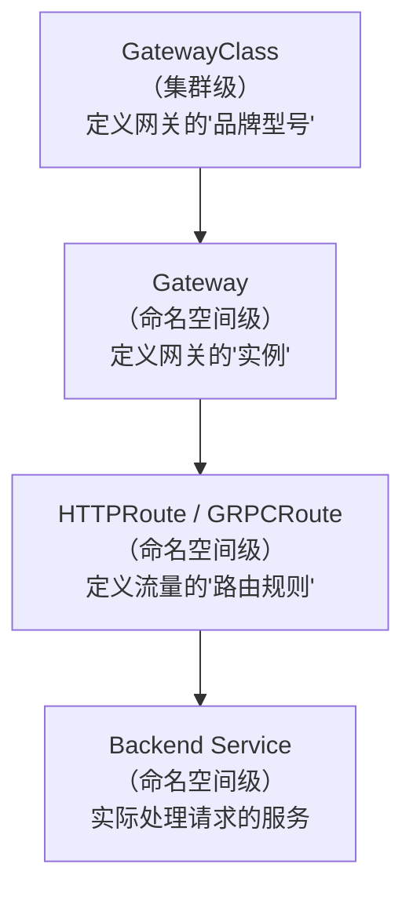
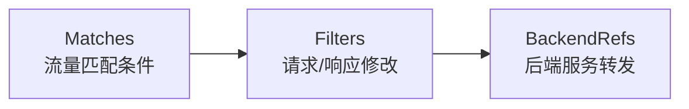
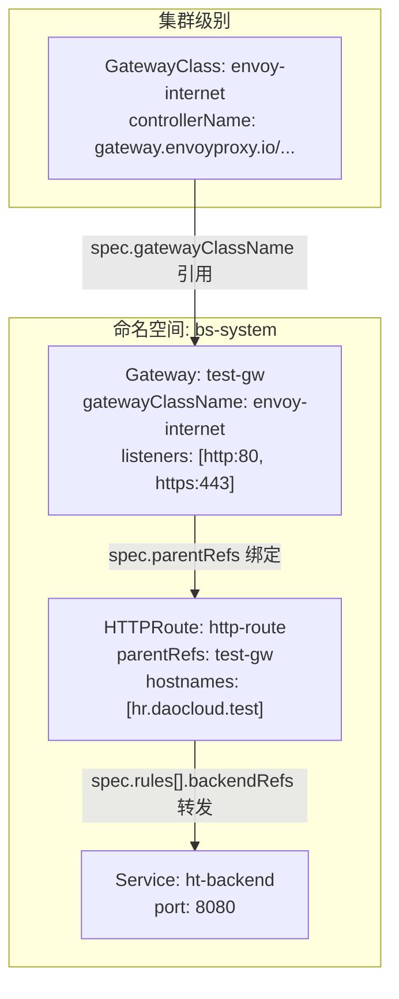

# Kpanda Gateway API 功能全景解析

## 一、整体架构：三层资源模型

Kubernetes Gateway API 采用了一套**三层分离**的资源模型设计，从上到下分别是：



这三层资源各自解决不同层面的问题：

| 层级 | 资源 | 作用域 | 谁来管理 | 类比 |
|------|------|--------|---------|------|
| 第一层 | **GatewayClass** | 集群级（Cluster-scoped） | 平台管理员 | 汽车的"品牌型号"（如 Envoy、Istio、Nginx） |
| 第二层 | **Gateway** | 命名空间级 | 集群管理员 | 具体购买的一辆"车"（绑定了 IP、端口、证书） |
| 第三层 | **HTTPRoute / GRPCRoute** | 命名空间级 | 应用开发者 | 车上设置的"导航路线"（哪条路走哪个方向） |

> [!IMPORTANT]
> **核心设计哲学：关注点分离（Separation of Concerns）。**
> 平台管理员只关心选择哪个网关控制器（GatewayClass）；集群管理员只关心网关暴露哪些端口和域名（Gateway）；应用开发者只关心自己的流量怎么转发（Route）。三者互不干扰。

---

## 二、GatewayClass —— 网关的"品牌定义"

### 2.1 定位
GatewayClass 是**集群级别**的资源，它不属于任何命名空间。它定义了"我要用哪个网关控制器来处理流量"，就像选择用 Envoy、Istio 还是 Nginx 来充当网关引擎。

### 2.2 核心字段

| 字段 | 路径 | 说明 |
|------|------|------|
| **名称** | `metadata.name` | 资源名称，集群内唯一 |
| **别名** | `metadata.annotations['kapnda.io/alias-name']` | Kpanda 自定义的别名展示 |
| **状态** | `status` | 枚举类型，常见值为 `Accepted` |
| **控制器名称** | `spec.controllerName` | **创建后不可变更**。域名风格的字符串，标识实现该 GatewayClass 的控制器，例如：`gateway.envoyproxy.io/gatewayclass-controller`、`istio.io/gateway-controller` |
| **配置参数** | `spec.parametersRef` | 引用一个外部资源（ConfigMap / Secret / 自定义 CRD）来提供额外的全局配置 |

### 2.3 parametersRef（引用资源）详解
`parametersRef` 是 GatewayClass 独有的高级特性，它允许管理员通过引用外部资源来传递网关控制器的全局配置参数：

| 子字段 | 说明 | 示例 |
|-------|------|------|
| `group` | API 组 | `""` (核心组，用于 ConfigMap/Secret) 或 `gateway.envoyproxy.io` |
| `kind` | 资源类型 | `ConfigMap`、`Secret`、`EnvoyProxy` |
| `name` | 资源名称 | `custom-proxy-config` |
| `namespace` | 所在命名空间 | `envoy-gateway-system` |

在 UI 上，展示格式遵循产品建议：`Kind/Name(Namespace)`，例如 `ConfigMap/default-gc-config(gateway-system)`。

### 2.4 CRD 示例
```yaml
apiVersion: gateway.networking.k8s.io/v1
kind: GatewayClass
metadata:
  name: envoy-internet
  labels:
    app.kubernetes.io/managed-by: envoy-gateway
spec:
  controllerName: gateway.envoyproxy.io/gatewayclass-controller
  parametersRef:
    group: gateway.envoyproxy.io
    kind: EnvoyProxy
    name: custom-proxy-config
    namespace: envoy-gateway-system
```

---

## 三、Gateway —— 网关的"实例"

### 3.1 定位
Gateway 是**命名空间级别**的资源。它是网关的具体实例，绑定了一个 GatewayClass（告诉 K8s 用什么引擎来跑），同时定义了**监听哪些端口、域名、协议**以及**TLS 证书配置**。

### 3.2 核心字段

| 字段 | 路径 | 说明 |
|------|------|------|
| **名称** | `metadata.name` | 资源名称 |
| **别名** | `metadata.annotations['kapnda.io/alias-name']` | Kpanda 自定义别名 |
| **状态** | `status` | 枚举类型 |
| **GatewayClass** | `spec.gatewayClassName` | 指定使用的 GatewayClass |
| **命名空间** | `metadata.namespace` | 所属命名空间 |
| **外部地址** | `spec.addresses[]` | 数组。每项包含 `type`（如 IPAddress）和 `value`（如 10.23.44.12） |

### 3.3 监听端口（Listeners）—— Gateway 的核心

Listeners 是 Gateway 最复杂也最重要的部分。每个 Listener 定义了网关上的一个"入口点"：

| 子字段 | 路径 | 说明 |
|-------|------|------|
| **名称** | `listeners[].name` | 监听器名称，如 `http`、`https-api` |
| **端口** | `listeners[].port` | 端口号，范围 1~65535 |
| **协议** | `listeners[].protocol` | 枚举：`HTTP`、`HTTPS`、`TLS`、`TCP`、`UDP` |
| **Hostname** | `listeners[].hostname` | 域名风格字符串，仅对 HTTP/HTTPS/TLS 有效，如 `api.example.com` 或 `*.dev.example.com` |

#### TLS 配置（仅 HTTPS/TLS 协议生效）

| 子字段 | 路径 | 说明 |
|-------|------|------|
| **TLS 模式** | `listeners[].tls.mode` | 枚举：`Terminate`（在网关层终止 TLS）、`Passthrough`（透传到后端） |
| **证书引用** | `listeners[].tls.certificateRefs` | 数组，引用 `Secret`、`ConfigMap` 或自定义资源 |
| **TLS 选项** | `listeners[].tls.options` | Key-Value 对象，用于厂商特定的 TLS 配置（如最低 TLS 版本） |

#### 允许的路由策略（Allowed Routes）

这是 Gateway 控制"哪些 Route 可以绑定到这个 Listener 上"的安全机制：

| 子字段 | 路径 | 说明 |
|-------|------|------|
| **命名空间策略** | `listeners[].allowedRoutes.namespaces.from` | 枚举：`Same`（仅同命名空间）、`All`（所有命名空间）、`Selector`（按标签选择） |
| **标签选择器** | `listeners[].allowedRoutes.namespaces.selector.matchLabels` | 仅当 `from=Selector` 时生效 |
| **允许的资源类型** | `listeners[].allowedRoutes.kinds` | 控制允许哪些类型的 Route 绑定（如只允许 HTTPRoute，或同时允许 GRPCRoute） |

### 3.4 CRD 示例
```yaml
apiVersion: gateway.networking.k8s.io/v1
kind: Gateway
metadata:
  name: test-gw
  namespace: bs-system
spec:
  gatewayClassName: envoy-gateway
  listeners:
    - name: http
      port: 80
      protocol: HTTP
      allowedRoutes:
        namespaces:
          from: Same
    - name: https-api
      port: 443
      protocol: HTTPS
      hostname: api.example.com
      tls:
        mode: Terminate
        certificateRefs:
          - name: api-example-com-tls
      allowedRoutes:
        namespaces:
          from: Selector
          selector:
            matchLabels:
              exposed-to-gateway: "true"
  addresses:
    - type: IPAddress
      value: 10.23.44.12
```

---

## 四、Route（路由）—— 流量的"导航规则"

### 4.1 定位
Route 是**命名空间级别**的资源，是三层模型的最底层。它定义了"匹配什么样的请求 → 转发到哪个后端服务"。Kpanda 支持两种路由类型：

| 路由类型 | 适用场景 |
|---------|---------|
| **HTTPRoute** | HTTP/HTTPS 请求（支持路径、请求头、查询参数匹配） |
| **GRPCRoute** | gRPC 请求（支持服务名+方法名匹配，无路径和查询参数） |

### 4.2 核心字段

| 字段 | 路径 | 说明 |
|------|------|------|
| **名称** | `metadata.name` | 资源名称 |
| **路由类型** | `kind` | `HTTPRoute` 或 `GRPCRoute` |
| **状态** | `status` | 枚举类型 |
| **所属网关** | `spec.parentRefs[]` | 数组，每项包含 `name` 和可选的 `namespace`，表示绑定到哪个 Gateway |
| **域名匹配** | `spec.hostnames` | 字符串数组，如 `["hr.daocloud.test"]` |
| **命名空间** | `metadata.namespace` | 所属命名空间 |

### 4.3 规则（Rules）—— Route 的核心

每条 Route 可以包含多条 Rule，每条 Rule 由三部分组成：



#### 4.3.1 流量匹配条件（Matches）

**HTTPRoute 匹配条件：**

| 字段 | 路径 | 说明 |
|------|------|------|
| **路径** | `matches[].path` | `type`（PathPrefix / Exact / RegularExpression）+ `value` |
| **请求方法** | `matches[].method` | 枚举：GET, HEAD, POST, PUT, DELETE, CONNECT, OPTIONS, TRACE, PATCH |
| **请求头** | `matches[].headers` | 数组，每项含 `name`、`value`、`type`（Exact / RegularExpression） |
| **查询参数** | `matches[].queryParams` | 数组，每项含 `name`、`value`、`type`（Exact / RegularExpression） |

> [!NOTE]
> 同一个 `matches[]` 元素内的多个条件之间是 **AND（与）** 关系；多个 `matches[]` 元素之间是 **OR（或）** 关系。

**GRPCRoute 匹配条件（与 HTTPRoute 不同）：**

| 字段 | 路径 | 说明 |
|------|------|------|
| **方法** | `matches[].method` | 含 `type`（Exact / RegularExpression）、`service`（gRPC 服务名）、`method`（方法名） |
| **请求头** | `matches[].headers` | 同 HTTPRoute |
| ~~路径~~ | - | **GRPCRoute 没有路径匹配** |
| ~~查询参数~~ | - | **GRPCRoute 没有查询参数匹配** |

#### 4.3.2 过滤器（Filters）

过滤器在请求被转发到后端之前或之后修改请求/响应。共有 **4 种**过滤器类型：

| 过滤器类型 | 说明 | HTTPRoute | GRPCRoute |
|-----------|------|-----------|-----------|
| **RequestHeaderModifier** | 修改请求头：`add`（添加）、`set`（覆盖）、`remove`（删除） | ✅ | ✅ |
| **ResponseHeaderModifier** | 修改响应头：同上三种操作 | ✅ | ✅ |
| **URLRewrite** | 路径重写：`ReplacePrefixMatch`（替换前缀）或 `ReplaceFullPath`（替换全路径） | ✅ | ❌ |
| **RequestMirror** | 流量镜像：将请求复制一份发到指定服务（不影响正常响应） | ✅ | ✅ |

> [!TIP]
> **流量镜像**的实现方式比较特殊——它不是一个独立的开关，而是通过在 `filters` 数组中添加一条 `type: RequestMirror` 的 filter 来启用的。

#### 4.3.3 后端服务（BackendRefs）

定义匹配到的请求最终转发到哪些服务：

| 字段 | 路径 | 说明 |
|------|------|------|
| **服务名称** | `backendRefs[].name` | 目标 K8s Service 的 name |
| **端口** | `backendRefs[].port` | Service 的端口 |
| **权重** | `backendRefs[].weight` | 流量权重（用于金丝雀发布、灰度发布等场景） |

### 4.4 CRD 示例
```yaml
apiVersion: gateway.networking.k8s.io/v1
kind: HTTPRoute
metadata:
  name: http-route
  namespace: bs-system
spec:
  parentRefs:
    - name: test-gw
      namespace: bs-system
  hostnames:
    - hr.daocloud.test
  rules:
    - matches:
        - path:
            type: PathPrefix
            value: /api
          method: POST
          headers:
            - type: Exact
              name: X-Api-Version
              value: v2
      filters:
        - type: RequestHeaderModifier
          requestHeaderModifier:
            add:
              - name: X-Internal-Source
                value: gateway-api
        - type: URLRewrite
          urlRewrite:
            path:
              type: ReplacePrefixMatch
              replacePrefix: /v2
      backendRefs:
        - name: ht-backend
          port: 8080
          weight: 100
```

---

## 五、三者之间的关系与数据流



**一句话概括数据流：**
> 外部请求 → 命中 Gateway 的某个 Listener（端口+协议+域名） → 匹配到某条 HTTPRoute 的 Rule（路径+方法+请求头） → 经过 Filters 修改 → 转发到 BackendRefs 指定的 Service。

---

## 六、权限模型

文档中还定义了权限控制策略：

| 角色 | 能力 |
|------|------|
| **ns-admin（命名空间管理员）** | 仅能查询自己有权限的命名空间下的 Gateway |
| **ns-admin 创建 Gateway 时** | 调用 `ListAccessibleGatewayClasses` 查询其 NS 所在集群的 GatewayClass |
| **cluster-admin（集群管理员）** | 调用 `ListGatewayClasses` 查看所有 GatewayClass |

---

## 七、Kpanda 特有的扩展点

相比于原生 Kubernetes Gateway API，Kpanda 在以下方面做了定制扩展：

1. **别名机制**：通过 `metadata.annotations['kapnda.io/alias-name']` 为资源添加中文友好名。
2. **CRD 安装引导**：Kpanda 默认不安装 Gateway API 的 CRD。在 `get cluster` 接口的 `status.settings.network` 中检测 GatewayAPI 是否启用，未启用时引导用户通过 Helm 安装。
3. **parametersRef 的自定义资源发现**：通过 `ListCustomResourceDefinitionGroups` 和 `ListCustomResourceDefinitions` 两个接口实现 API Group → Kind 的级联下拉框。

---

## 八、我们原型已实现的功能覆盖

| 功能 | Gateway | Router | GatewayClass |
|------|---------|--------|-------------|
| 详情页基本信息展示 | ✅ | ✅ | ✅ |
| 监听端口 / 规则 / 引用资源 Tab | ✅ | ✅ | ✅ |
| 标签与注解（可增删改） | ✅ | ✅ | ✅ |
| 查看 YAML（暗色代码预览） | ✅ | ✅ | ✅ |
| 编辑 YAML（可编辑文本区） | ✅ | ✅ | ✅ |
| 更新（跳转编辑页） | ✅ | ✅ | ✅ |
| 删除（二次确认+名称输入） | ✅ | ✅ | ✅ |
| 中英文国际化切换 | ✅ | ✅ | ✅ |
| 列表页 | ❌ 待实现 | ❌ 待实现 | ❌ 待实现 |
| 创建表单 | ❌ 待实现 | ❌ 待实现 | ❌ 待实现 |
